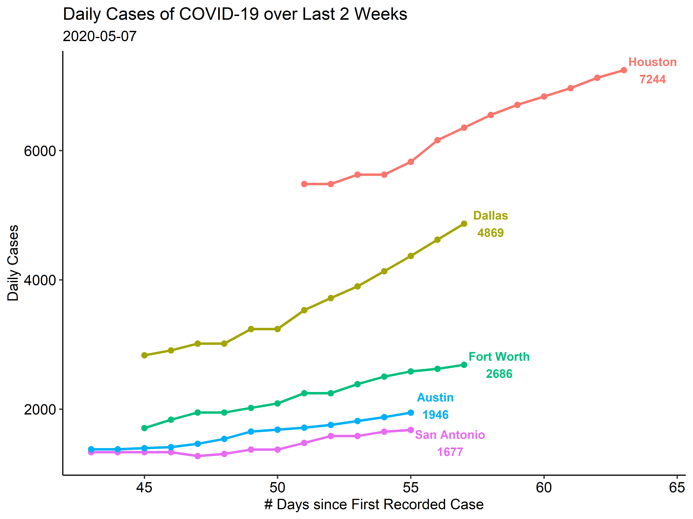
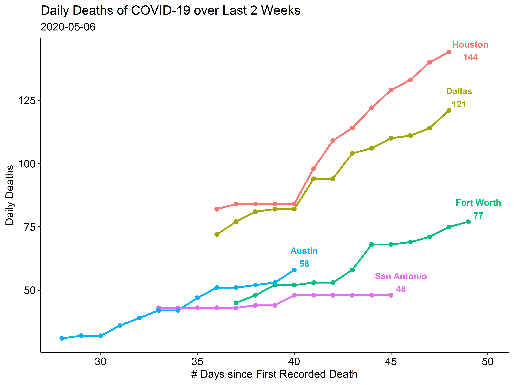

# COVID-19 Visualizations

Counts of cases and deaths for 5 major Texas cities, updated daily. 

County-level data sourced from [John's Hopkins](https://github.com/CSSEGISandData/COVID-19)

## Cases

## Deaths

---

TODO: 

- [x] automate uploads
- [ ] animations
- [ ] Shiny app for different counties